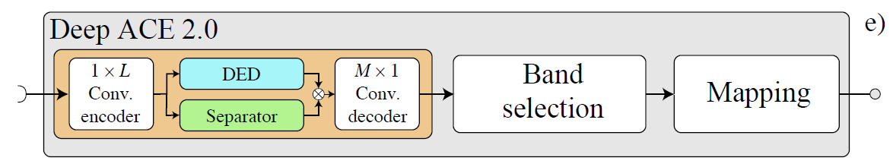

# Deep ACE 2.0

Cochlear implants (CIs) have proven to be successful at restoring the sensation of hearing in people who suffer from profound sensorineural hearing loss. CI users generally achieve good speech understanding in quiet acoustic conditions. However,
their hearing ability degrades drastically in noisy backgrounds. To address this problem, current CI systems are delivered with front-end speech enhancement processors that can be beneficial for the listener, however, these perform well only in certain noisy environments, leaving quite some room for improvement in more challenging conditions. In this work, we propose substituting the CI sound coding strategy with a deep neural network (DNN) that performs end-to-end processing by taking the raw audio as input and providing a denoised electrodogram, i.e., the electrical stimulation patterns that are applied to the electrodes across time. We specifically design a DNN to emulate a common CI sound coding strategy; the advanced combination encoder (ACE). The DNN is designed not only to faithfully emulate the coding of acoustic signals that ACE would perform but also to remove unwanted interfering noises, when present, without sacrificing processing latency. The models were optimized using CIspecific loss functions and evaluated using objective instrumental measures and listening tests in CI participants. Results show that the proposed models achieve higher signal-to-noise ratio improvement and objective intelligibility scores when compared to the baseline models. Furthermore, the proposed deep learningbased sound coding strategy improved speech intelligibility in eight CI users.

  

# Requirements
See [Requirements.txt](requirements.txt)

# References

[1] Martín Abadi, Ashish Agarwal, Paul Barham, Eugene Brevdo, Zhifeng Chen, Craig Citro, Greg S. Corrado, Andy Davis, Jeffrey Dean, Matthieu Devin, Sanjay Ghemawat, Ian Goodfellow, Andrew Harp, Geoffrey Irving, Michael Isard, Rafal Jozefowicz, Yangqing Jia, Lukasz Kaiser, Manjunath Kudlur, Josh Levenberg, Dan Mané, Mike Schuster, Rajat Monga, Sherry Moore, Derek Murray, Chris Olah, Jonathon Shlens, Benoit Steiner, Ilya Sutskever, Kunal Talwar, Paul Tucker, Vincent Vanhoucke, Vijay Vasudevan, Fernanda Viégas, Oriol Vinyals, Pete Warden, Martin Wattenberg, Martin Wicke, Yuan Yu, and Xiaoqiang Zheng. TensorFlow: Large-scale machine learning on heterogeneous systems, 2015. Software available from tensorflow.org.

[2] Y. Luo and N. Mesgarani, “Conv-TasNet: Surpassing ideal time–frequency magnitude masking for speech separation,” IEEE/ACM Transactions on Audio, Speech, and Language Processing, vol. 27, pp. 1256–1266, 2019.

[3] T. Gajecki and W. Nogueira, “An end-to-end deep learning speech coding and denoising strategy for cochlear implants,” in ICASSP 2022-2022 IEEE International Conference on Acoustics, Speech and Signal Processing (ICASSP). IEEE, 2022, pp. 3109–3113.
